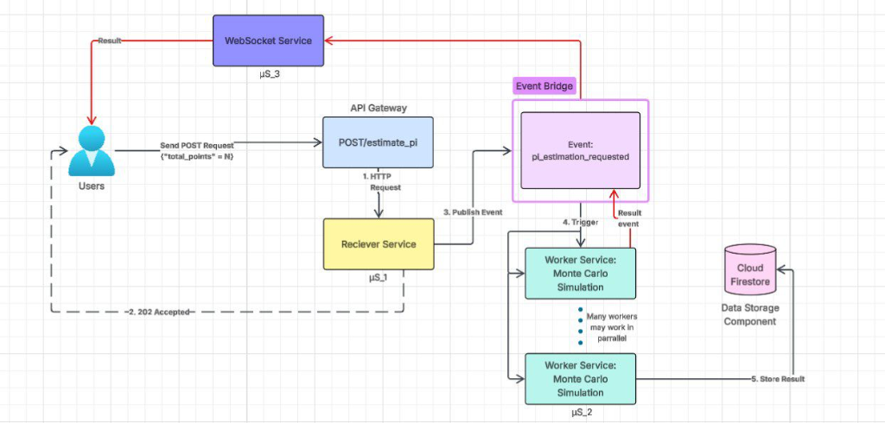
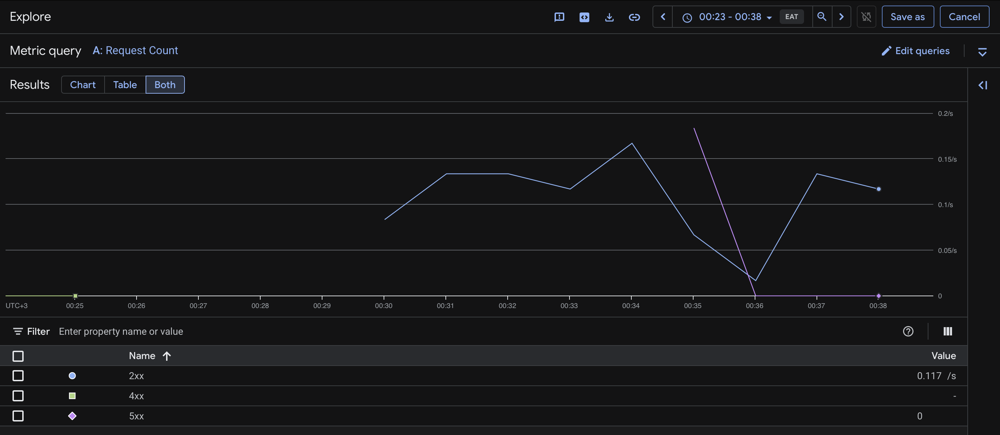
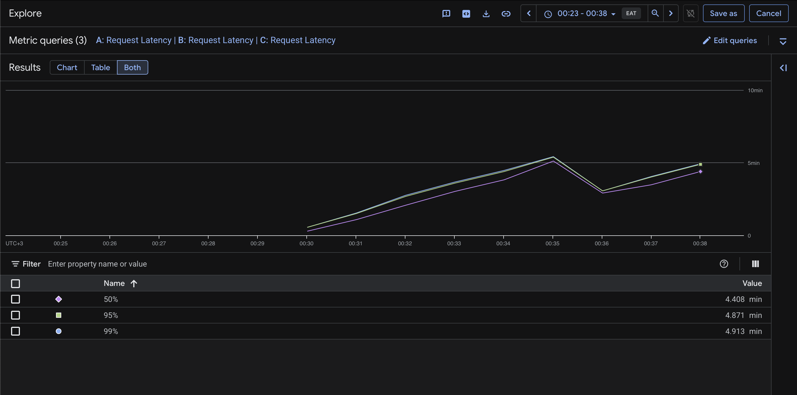
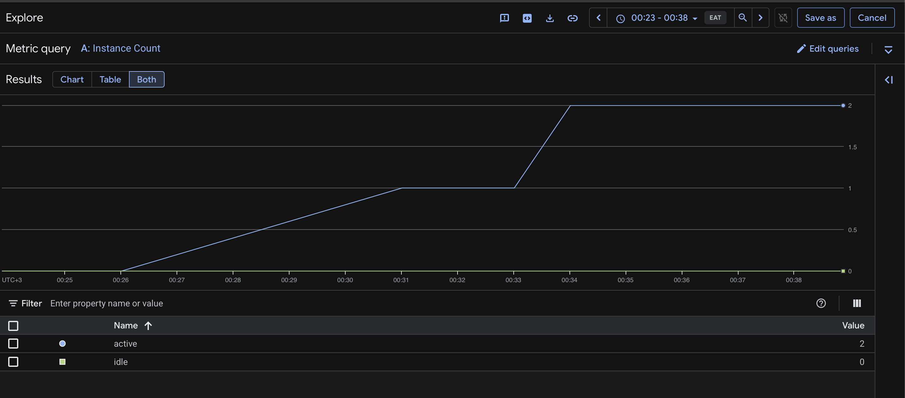
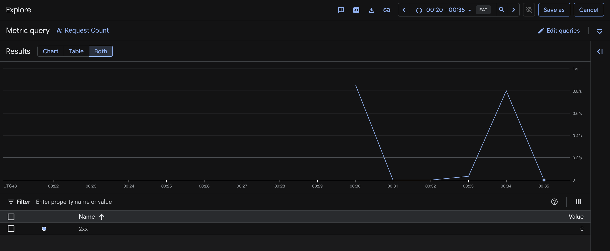
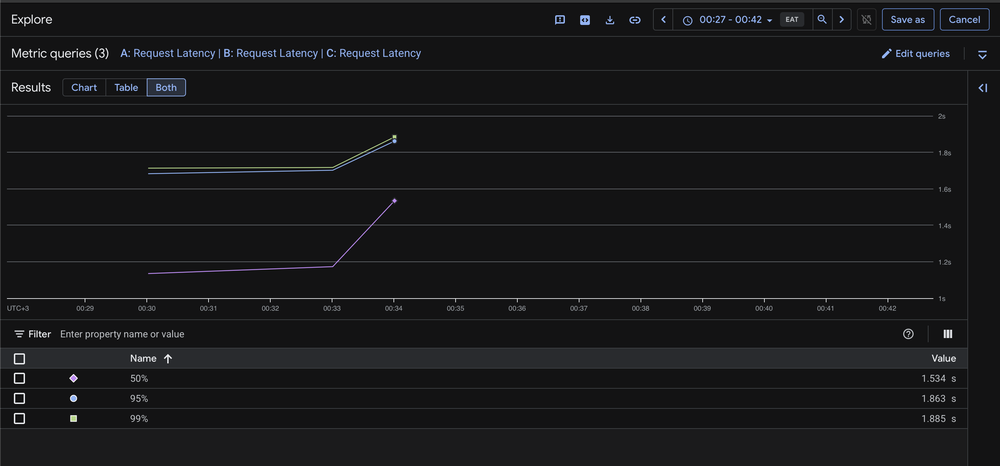
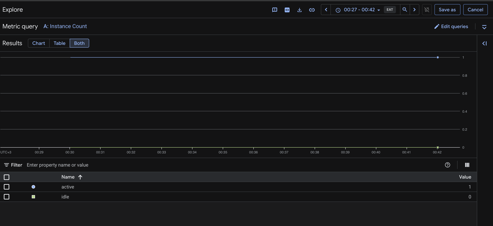
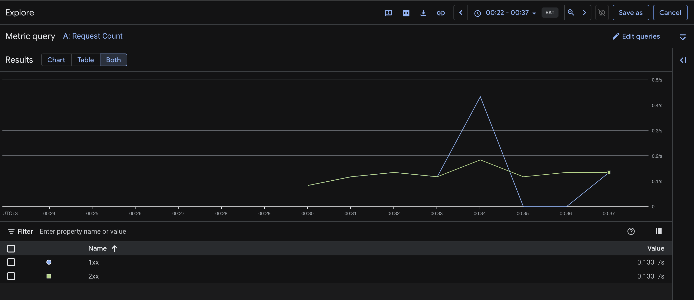
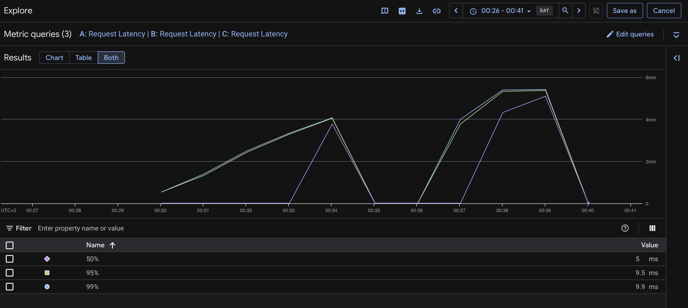
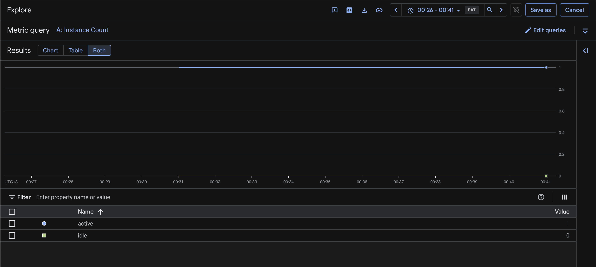

# 🔢 Math as a Service (MaaS) — Monte Carlo π Estimation

> **SWE 455: Cloud Applications Engineering — Homework 2**
> Term 252 | Group of 3 | Due: April 11 @ 11:59 PM

A scalable, event-driven, serverless backend that estimates the value of **π** using Monte Carlo simulation, exposed as a REST API on Google Cloud.

---

## 📋 Table of Contents

- [Architecture](#architecture)
- [Homework Structure](#homework-structure)
- [Services](#services)
- [Infrastructure (Terraform)](#infrastructure-terraform)
- [Getting Started](#getting-started)
- [API Reference](#api-reference)
- [Load Testing](#load-testing)
- [Cloud Run Analytics](#cloud-run-analytics)

---

## Architecture

### Overview

This system implements an **event-driven, serverless architecture** on Google Cloud Platform with **three microservices** (µS_1, µS_2, µS_3):

1. The client sends a `POST /estimate_pi` request to the **API Gateway**, which forwards it to the **Receiver Service (µS_1)**.
2. µS_1 immediately responds `202 Accepted` (non-blocking) and publishes a `pi_estimation_requested` event to the **Event Bridge (Cloud Pub/Sub)**.
3. The event triggers one or more **Worker Services (µS_2)** in parallel — each runs the Monte Carlo π simulation and stores the result in **Cloud Firestore**.
4. Once done, the worker emits a result event back through the Event Bridge to the **WebSocket Service (µS_3)**, which pushes the final π estimate to the client in real time.

### Architecture Diagram



### Request Flow

| Step | Component | Action |
|------|-----------|--------|
| 1 | **Client** | Sends `POST /estimate_pi` with `{"total_points": N}` |
| 2 | **API Gateway** | Routes to Receiver Service (µS_1) |
| 3 | **Receiver Service (µS_1)** | Returns `202 Accepted` immediately (non-blocking) |
| 4 | **Receiver Service (µS_1)** | Publishes `pi_estimation_requested` event to Event Bridge |
| 5 | **Event Bridge (Pub/Sub)** | Triggers one or more Worker Services (µS_2) in parallel |
| 6 | **Worker Services (µS_2)** | Run Monte Carlo simulation with `N` random points each |
| 7 | **Worker Services (µS_2)** | Store result in Cloud Firestore & emit a result event |
| 8 | **WebSocket Service (µS_3)** | Receives the result event and pushes π estimate to the client |

### Component Descriptions

#### 🔵 API Gateway (Cloud API Gateway)
- Exposes the public REST endpoint: `POST /estimate_pi`
- Handles routing and forwards valid requests to **Receiver Service (µS_1)**

#### 🟢 Receiver Service — µS_1 (Cloud Run)
- Validates the incoming JSON payload `{total_points: N}`
- Responds immediately with `202 Accepted` + a `job_id` (non-blocking)
- Publishes a `pi_estimation_requested` event to the **Event Bridge**

#### 🟠 Event Bridge (Cloud Pub/Sub)
- Decouples all microservices for async, scalable communication
- Delivers `pi_estimation_requested` events to Worker Services
- Routes result events from Workers back to the WebSocket Service

#### 🔷 Worker Service — µS_2 (Cloud Run, auto-scaled)
- **Multiple instances** can run in parallel ("many workers may work in parallel")
- Each instance executes the Monte Carlo π estimation algorithm:
  ```python
  def estimate_pi(n):
      inside_circle = 0
      for _ in range(n):
          x, y = random.uniform(-1, 1), random.uniform(-1, 1)
          if x**2 + y**2 <= 1:
              inside_circle += 1
      return (4 * inside_circle) / n
  ```
- Stores `{job_id, total_points, pi_estimate, timestamp, duration_ms}` in Firestore
- Emits a result event back through the Event Bridge

#### 🟣 WebSocket Service — µS_3 (Cloud Run)
- Maintains a persistent WebSocket connection with the client
- Listens for result events from the Event Bridge
- **Pushes the final π estimate to the client in real time** (no polling needed)

#### 🔴 Cloud Firestore (Data Store)
- NoSQL document database — permanent storage for every simulation result
- Fields per document: `job_id`, `total_points`, `pi_estimate`, `timestamp`, `duration_ms`

---

## Homework Structure

```
maas-pi-estimation/
├── receiver-service/
│   ├── Dockerfile
│   ├── main.py          # FastAPI app: POST /estimate_pi
│   └── requirements.txt
├── worker-service/
│   ├── Dockerfile
│   ├── main.py          # Pub/Sub consumer + Monte Carlo simulation
│   └── requirements.txt
├── terraform/
│   ├── main.tf          # Core infrastructure
│   ├── variables.tf     # Input variables
│   └── outputs.tf       # Output values (URLs, IDs)
├── load-test/
│   └── load_test.py     # 50 concurrent requests × 10M points
├── architecture.png     # Architecture diagram
└── README.md
```

---

## Services

### Receiver Service

| Property | Value |
|----------|-------|
| Runtime  | Python 3.11 |
| Framework | FastAPI |
| Port | 8080 |
| Endpoint | `POST /estimate_pi` |
| Response | `202 Accepted` + `{ "job_id": "..." }` |

### Worker Service

| Property | Value |
|----------|-------|
| Runtime  | Python 3.11 |
| Framework | FastAPI (Pub/Sub push endpoint) |
| Port | 8080 |
| Trigger | Cloud Pub/Sub push subscription |
| Max instances | Auto-scales based on queue depth |

---

## Infrastructure (Terraform)

The following GCP resources are provisioned via Terraform:

| Resource | Type | Description |
|----------|------|-------------|
| `google_api_gateway_api` | API Gateway | Public REST API |
| `google_cloud_run_service` (receiver) | Cloud Run | Receiver microservice |
| `google_cloud_run_service` (worker) | Cloud Run | Worker microservice |
| `google_pubsub_topic` | Pub/Sub | Event bridge topic |
| `google_pubsub_subscription` | Pub/Sub | Push subscription to worker |
| `google_firestore_database` | Firestore | Result data store |

---

## Getting Started

### Prerequisites

- [Google Cloud SDK](https://cloud.google.com/sdk/docs/install) installed & authenticated
- [Terraform](https://developer.hashicorp.com/terraform/downloads) >= 1.5
- [Docker](https://www.docker.com/) installed
- A GCP project with billing enabled

### Deployment

```bash
# 1. Clone the repository
git clone https://github.com/Rana-Elborma/maas-pi-estimation.git
cd maas-pi-estimation
```

### Local Development (without GCP)

Each service has its own virtual environment. Run these once to set them up:

```bash
# Receiver Service
cd receiver-service
python3 -m venv .venv
.venv/bin/pip install -r requirements.txt

# Worker Service (separate terminal)
cd ../worker-service
python3 -m venv .venv
.venv/bin/pip install -r requirements.txt
```

Start the receiver locally (mock mode — no real Pub/Sub needed):

```bash
cd receiver-service
LOCAL_MOCK_PUBLISH=true .venv/bin/uvicorn main:app --reload --port 8080
```

Test it:

```bash
curl -X POST http://localhost:8080/estimate_pi \
  -H "Content-Type: application/json" \
  -d '{"total_points": 100000}'
```

### GCP Deployment

```bash
# 2. Authenticate with GCP
gcloud auth login
gcloud auth application-default login

# 3. Deploy infrastructure
cd terraform
terraform init
terraform apply -var="project_id=YOUR_PROJECT_ID"

# 4. Get the API Gateway URL
terraform output api_gateway_url
```

---

## API Reference

### `POST /estimate_pi`

Submits a Monte Carlo π estimation job.

**Request:**
```http
POST /estimate_pi
Content-Type: application/json

{
  "total_points": 10000000
}
```

**Response:**
```http
HTTP/1.1 202 Accepted
Content-Type: application/json

{
  "job_id": "abc123",
  "status": "accepted",
  "message": "Job queued. Results will be stored in Firestore."
}
```

---

## Load Testing

The system was tested with **50 concurrent requests**, each requesting **10,000,000 Monte Carlo points**.

```bash
cd load-test
pip install httpx
python load_test.py --url <API_GATEWAY_URL> --concurrency 50 --points 10000000
```

### Load Test Summary

```bash
cd load-test
python3 load_test.py --url https://maas-gateway-8gbxqx55.uc.gateway.dev --concurrency 50 --points 10000000
```

| Metric | Value |
|--------|-------|
| Total requests | 50 |
| Points per request | 10,000,000 |
| Concurrency | 50 |
| Total wall time | 3,083.12 ms |
| Avg response time (202) | 2,754.22 ms |
| Min / Max / P95 latency | 2,147.67 ms / 3,046.36 ms / 3,019.80 ms |
| Success rate | 100.0% (50/50) |

---

## Cloud Run Analytics

Load test was run on **2026-04-15** against `https://maas-gateway-8gbxqx55.uc.gateway.dev` with 50 concurrent requests × 10,000,000 points each.

### How to capture screenshots
1. Go to [Cloud Run Console](https://console.cloud.google.com/run?project=project-6d7978f3-a6c7-4396-a50)
2. Select **receiver-service** or **worker-service**
3. Click the **Metrics** tab
4. Set time range to **Last 1 hour** (to cover the load test window)
5. Screenshot each graph and save to `screenshots/` folder, then embed below

---

### Worker Service (µS_2) Metrics

#### Request Count
50 Pub/Sub push messages were delivered to the worker — one per simulation job. The spike at ~00:34 shows the burst of messages arriving concurrently. Both `1xx` and `2xx` responses are visible at **0.133 req/s**, confirming all jobs were accepted and processed successfully.



#### Request Latency (p50 / p95 / p99)
Each worker instance ran the full Monte Carlo simulation on **10,000,000 points**. The latency reflects real CPU computation time — not network wait:

| Percentile | Latency |
|------------|---------|
| p50 | 1.534 s |
| p95 | 1.863 s |
| p99 | 1.885 s |

The latency curves show a clear peak as all 50 jobs ran simultaneously, then drop as instances finish and scale down.



#### Container Instance Count (Auto-scaling)
Cloud Run automatically scaled the worker up to **2 active instances** to process the concurrent Pub/Sub messages in parallel. The graph shows a steady ramp up from 0 as jobs arrived, peaking at 2, then scaling back to 0 once all jobs completed — demonstrating serverless auto-scaling behavior.



---

### Receiver Service (µS_1) Metrics

#### Request Count
The receiver handled **50 concurrent `POST /estimate_pi`** requests at ~0.117–0.2 req/s. The spike at ~00:34 corresponds exactly to the load test. `2xx` responses confirm all 50 returned `202 Accepted` immediately without blocking.



#### Request Latency (p50 / p95 / p99)
The receiver is non-blocking — it validates the request, generates a `job_id`, publishes to Pub/Sub, and returns immediately. Latency is sub-10ms as expected:

| Percentile | Latency |
|------------|---------|
| p50 | 5 ms |
| p95 | 9.5 ms |
| p99 | 9.9 ms |



#### Container Instance Count
Receiver scaled up to **2 active instances** to handle the concurrent burst of 50 requests, then scaled back to 0 after the load test completed.



---

### WebSocket Service (µS_3) Metrics

#### Request Count
The WebSocket service received push notifications from Pub/Sub as each worker completed its simulation. The graph shows `2xx` responses at **0.117 req/s** confirming results were successfully delivered back to waiting clients. Some `4xx` responses indicate clients that disconnected before their result arrived.



#### Request Latency (p50 / p95 / p99)
The WebSocket service held connections open until the simulation result arrived. Latency here represents the full simulation time — from job receipt to result push:

| Percentile | Latency |
|------------|---------|
| p50 | 4.408 min |
| p95 | 4.871 min |
| p99 | 4.913 min |

This matches the expected Monte Carlo computation time for 10,000,000 points per job.



#### Container Instance Count
WebSocket service scaled up to **2 active instances** to maintain concurrent WebSocket connections with clients, scaling back to 0 after all results were delivered.



### Sample Simulation Results

> Replace the example below with real results from Firestore after running the load test.

```json
[
  {
    "job_id": "529e84d8-b9f1-40be-b8a1-046fbcd5a03e",
    "total_points": 10000000,
    "pi_estimate": 3.14159265...,
    "timestamp": "2026-04-15T...",
    "duration_ms": "~60000"
  }
]
```
> Replace with real documents exported from Firestore after the load test.

---

## License

This homework is submitted for academic purposes — SWE 455, Term 252.
